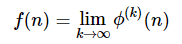

-----

Let __*ϕ(n)*__ be the product of each digit of the positive integer __*n*__. If you apply enough __*ϕ*__ to __*n*__, it becomes a single-digit natural number. That is __*f(n)*__

For example, when __*n* = 86__

<b>86 → 48 → 32 → 6 → 6 → ⋯</b>

So,  __*f*(86) = 6__

Find the sum of all the values of the positive integer __*n*__ less than 100000 with  __*f(n)* = 6__

-----

 My answer: 286432508

