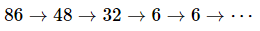

양의 정수 __*n*__의 각 자리수의 곱을 __*ϕ(n)*__이라고 하자. __*n*__에 __*ϕ*__를 충분히 많이 적용을 하면 한 자리 자연수가 되는데, 이를 함수 __*f(n)*__이라고 하자.  

  

예를 들어, __*n* = 86__일 때 다음과 같고 __*f*(86) = 6__이다.  

  

__*f(n)* = 6__인 100000 보다 작은 양의 정수 *n*을 모두 합한 값을 구하여라.

-----

Let __*ϕ(n)*__ be the product of each digit of the positive integer __*n*__. If you apply enough __*ϕ*__ to __*n*__, it becomes a single-digit natural number. That is __*f(n)*__  

  

For example, when __*n* = 86__  

  

So,  __*f*(86) = 6__  
Find the sum of all the values of the positive integer __*n*__ less than 100000 with  __*f(n)* = 6__

-----

##### My answer: 286432508

