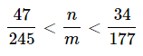
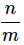

다음을 만족하는 분수 __*n*__ , __*m*__ 중 분모가 가장 작은 분수에 대하여 __*n*__ + __*m*__ 의 값을 구하여라. (단, __*n*__ 과 __*m*__ 은 서로소인 양의 정수이다.)  

  

---

The fraction  satisfies the following condition. (However, __*n*__ and __*m*__ are positive integers that are mutually prime.)  

  
Find the value of __*n+m*__ with the smallest __*m*__.  

---

### My Answer: 118

